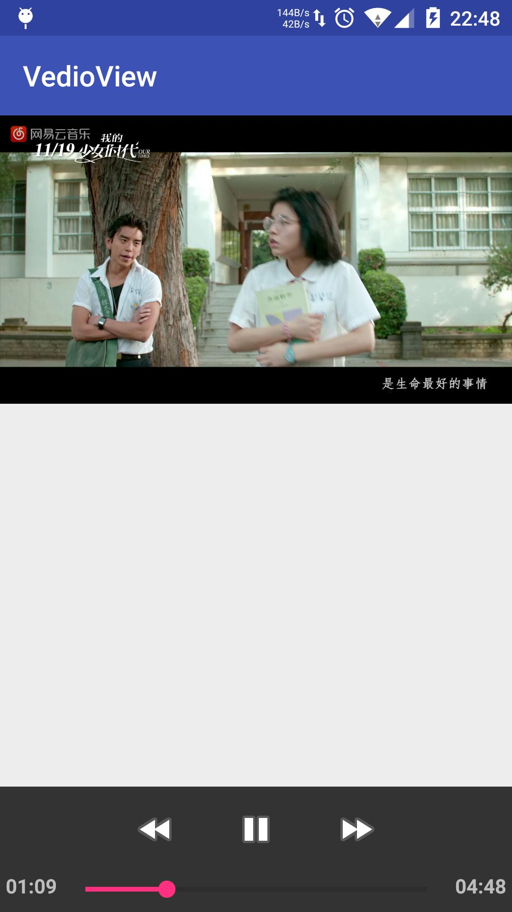

使用VideoView播放视频
=====================
为了使Android应用中播放播发视频Android提供Video组件，他就是一个位于android.widget包下组件，
作用与ImageView类似，只是ImageView用于显示图片，而ViewView用于播放视频

VideoView 播放视频基本步骤
--------------------------
- 1). 在界面布局中定义VideoView组件， 或者在程序中创建VideoView组件
- 2). 调用VideoView对象的start(), stop(), pause()方法控制视频播放
   -- setVideoPath(String path):加载path文件所代表的视频
   -- setVideoURL(Uri uri): 加载Url所对应的视频
- 3). 调用Video对象的start(), stop(), pause()方法控制视频播放
Notes
-----
实际上和VideoView一起结合使用的还有MediaController类, 他的作用是提供一个友好的界面,通过控制界面来控制视频的播放
但是用setVideoURL(Uri.parse("file:///xxx"))

如果播放不出来的话，一般是路径没写对
或者没有相应的权限
播放网络视频需要android.permission.INTERNET(已添加)
中间有E/MediaPlayer-JNI: QCMediaPlayer mediaplayer NOT present可以不用管
就可定制性来讲VideoView比MediaPlayer要差

测试
-----
 